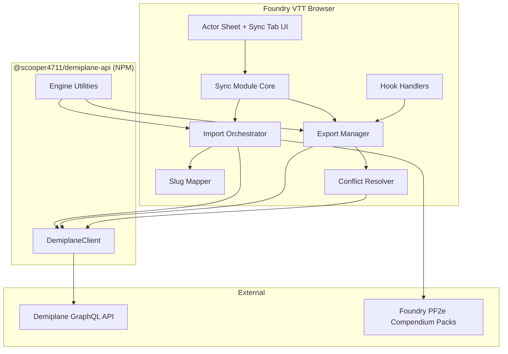
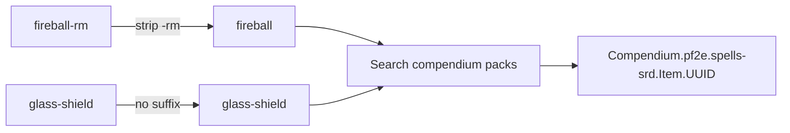
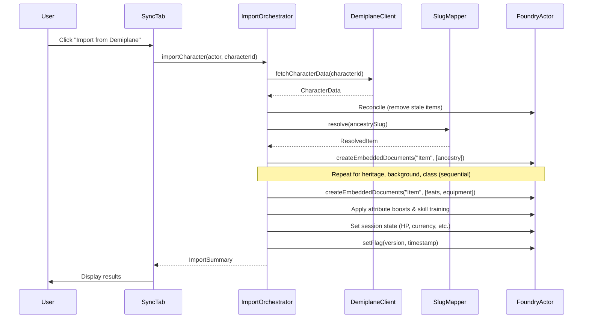
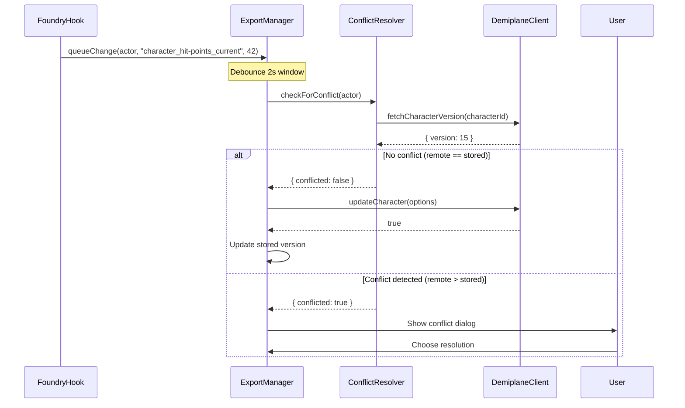

# Design Document: Demiplane ↔ Foundry VTT Sync

## Overview

This design describes a two-package system enabling bidirectional character synchronization between Demiplane Nexus and Foundry VTT for Pathfinder 2e:

1. **`@scooper4711/demiplane-api`** — A game-system-agnostic TypeScript library exposing authentication, GraphQL character queries, engine parsing/querying utilities, and character update mutations. Published to NPM for reuse by any Demiplane integration.

2. **`foundry-demiplane-pf2e`** — A Foundry VTT module that consumes the NPM library to perform bidirectional sync. It owns all PF2e-specific logic: slug mapping, compendium resolution, Grant Chain orchestration, actor population, session state export, conflict detection, and the actor sheet Sync tab UI.

**Data flow direction:**
- **Import (Demiplane → Foundry):** Character build data flows through the API client, gets translated by the Slug Mapper into compendium items, and is added to a Foundry actor via `createEmbeddedDocuments` to trigger the PF2e Grant Chain.
- **Export (Foundry → Demiplane):** Session state changes (HP, currency, hero points, focus points) are captured by Foundry hooks, debounced, conflict-checked, and pushed back via the `updateCharacterV2` mutation.

## Architecture



### Package Boundary

The NPM library (`demiplane-api`) is intentionally game-system-agnostic. It knows nothing about PF2e slugs, Foundry compendium packs, or actor structures. All PF2e-specific translation lives in the Foundry module.

This boundary enables future modules for other game systems (D&D 5e, Marvel Multiverse, etc.) to reuse the same API client with their own slug mapping and actor population logic.

### Key Architectural Decisions

| Decision | Rationale |
|----------|-----------|
| Populate existing actors, not create new ones | Players already have actors with tokens, permissions, and journal links. Creating new actors would break these associations. |
| Sequential `createEmbeddedDocuments` for ancestry/heritage/background/class | The PF2e Grant Chain cascades features when these items are added. Ordering ensures prerequisites are satisfied. |
| Debounce + rate limit for export | Prevents flooding Demiplane's API during rapid gameplay changes (combat HP fluctuations). |
| Version-based conflict detection | The character `version` integer monotonically increases. Comparing local vs remote version is a reliable conflict signal. |
| Email/password auth instead of session cookie | Simplifies credential management for end users — no browser extension or cookie extraction needed. |

## Components and Interfaces

### Package 1: `@scooper4711/demiplane-api`

#### DemiplaneClient (class)

The primary entrypoint. Manages authentication state and provides methods for all Demiplane API operations.

```typescript
class DemiplaneClient {
  authenticate(email: string, password: string): Promise<void>;
  fetchCharacterData(characterId: string): Promise<CharacterData>;
  fetchCharacterVersion(characterId: string): Promise<CharacterVersion>;
  fetchAttributeMapping(nexusId: number): Promise<AttributeMapping>;
  updateCharacter(options: UpdateCharacterOptions): Promise<boolean>;
}
```

**Changes from current implementation:**
- `authenticate()` switches from session-cookie-based auth to email/password credentials (per Requirement 1). Internally performs the credential exchange to obtain a GraphQL bearer token.
- `fetchCharacterData()` is new — fetches the complete `engines` array and `engineCacheIdsBySource` for a character UUID.
- All methods become usable without authentication for read-only operations on public characters. Write operations require prior authentication.

#### Engine Utilities (functions)

Pure functions for querying and transforming engine data. Already partially implemented.

```typescript
// Type guards
function isCustomEngine(engine: CharacterEngine): engine is CustomEngine;
function isDemiplaneEngine(engine: CharacterEngine): engine is DemiplaneEngine;

// Querying
function findCustomEngineByName(engines: CharacterEngine[], storeName: string): CustomEngine | undefined;
function findEnginesBySlug(engines: CharacterEngine[], slug: string): DemiplaneEngine[];
function findEnginesByNamePattern(engines: CharacterEngine[], pattern: RegExp): CharacterEngine[];

// Immutable updates
function updateCustomEngineValue(engines: CharacterEngine[], storeName: string, value: string | number | boolean): CharacterEngine[];
```

**New addition:** `findEnginesByNamePattern` to support Requirement 6.5.

#### Error Types

```typescript
class DemiplaneApiError extends Error {
  statusCode: number;
  operationName: string;
  requestUrl: string;
}
```

### Package 2: `foundry-demiplane-pf2e`

#### SlugMapper (class)

Translates Demiplane engine slugs into Foundry PF2e compendium item UUIDs.

```typescript
class SlugMapper {
  constructor(packSearchOrder: string[]);
  resolve(demiplaneSlug: string): Promise<ResolvedItem | undefined>;
}

interface ResolvedItem {
  uuid: string;
  packKey: string;
  slug: string;
}
```

**Transformation rules:**
1. If slug ends with `-rm`, strip the suffix.
2. Otherwise, pass unchanged.
3. Search indexed compendium packs for `system.slug === derivedSlug`.

**Pack search order:** `pf2e.classes`, `pf2e.ancestries`, `pf2e.heritages`, `pf2e.backgrounds`, `pf2e.feats-srd`, `pf2e.spells-srd`, `pf2e.equipment-srd`, `pf2e.classfeatures`.

#### ImportOrchestrator (class)

Coordinates a full character import from Demiplane into a Foundry actor.

```typescript
interface ImportOptions {
  dryRun?: boolean;  // When true, run pipeline without writes
}

class ImportOrchestrator {
  constructor(client: DemiplaneClient, slugMapper: SlugMapper);
  importCharacter(actor: Actor, characterId: string, options?: ImportOptions): Promise<ImportSummary>;
}

interface ImportSummary {
  itemsImported: number;
  itemsSkipped: number;
  errors: string[];
  preview: boolean;   // true when generated via dry run
}
```

**Import sequence:**
1. Fetch character data via `DemiplaneClient.fetchCharacterData()`
2. Extract character name, level from Custom_Engines
3. Clear existing items from previous import (reconciliation)
4. Add ancestry → heritage → background → class sequentially via `createEmbeddedDocuments`
5. Add feats, class features, equipment in batch
6. Apply attribute boosts and skill training (skipping Grant Chain duplicates)
7. Set session state values (HP, hero points, focus points, currency)
8. Store version number in actor flags

**Dry run behavior (when `options.dryRun` is true):**
Steps 1–2 execute normally (read-only). Step 3 computes the reconciliation diff but does not call `deleteEmbeddedDocuments`. Steps 4–6 resolve slugs and build the item list but skip all `createEmbeddedDocuments` calls. Steps 7–8 are skipped entirely. The returned `ImportSummary` reflects what *would* happen, with `preview: true`.

#### ExportManager (class)

Handles debounced session state export from Foundry to Demiplane.

```typescript
interface ExportOptions {
  dryRun?: boolean;  // When true, collect changes without pushing
}

class ExportManager {
  constructor(client: DemiplaneClient, conflictResolver: ConflictResolver);
  queueChange(actor: Actor, field: string, value: number): void;
  flush(actor: Actor, options?: ExportOptions): Promise<ExportResult>;
}

interface ExportResult {
  success: boolean;
  newVersion?: number;
  error?: string;
  conflictDetected?: boolean;
  preview?: PendingChange[];  // populated when dryRun is true
}
```

**Behavior:**
- `queueChange` accumulates field changes and resets the 2-second debounce timer.
- After the debounce window, it triggers a flush.
- Flush performs conflict detection, then pushes changes.
- Rate-limited to 30 API calls per 60-second rolling window per character.
- On failure, retries up to 3 times with exponential backoff (1s, 2s, 4s).

**Dry run behavior (when `options.dryRun` is true):**
`flush` collects the pending changes list and returns them in `ExportResult.preview` without calling `updateCharacterV2` or modifying any remote state. Conflict detection is still performed so users can see whether a conflict *would* occur, but no resolution actions are taken.

#### ConflictResolver (class)

Detects version conflicts and presents resolution options to the user.

```typescript
class ConflictResolver {
  constructor(client: DemiplaneClient);
  checkForConflict(actor: Actor): Promise<ConflictStatus>;
  resolveConflict(actor: Actor, resolution: "reimport" | "force-push" | "cancel"): Promise<void>;
}

type ConflictStatus = { conflicted: false } | { conflicted: true; localVersion: number; remoteVersion: number };
```

#### SyncTabRenderer (class)

Renders the Sync tab on actor sheets for linked characters.

```typescript
class SyncTabRenderer {
  renderTab(sheet: ActorSheet, html: JQuery): void;
}
```

**Tab sections:**
- Status: linked UUID, last sync timestamp, local/remote versions
- Dry run indicator: persistent badge/banner when `dryRun` setting is enabled, distinct from the in-progress spinner (per Requirement 15.12)
- Pending changes: field name + new value for each queued change
- Issues: unresolved slugs from last import
- Import summary: counts from last import (labeled as "Preview" when generated via dry run)
- Conflict warning: version mismatch + resolution buttons
- Actions: "Import from Demiplane" / "Push to Demiplane" buttons — labels change to "Preview Import" / "Preview Push" when dry run is enabled (per Requirement 15.13)
- Link dialog: input field accepting a bare UUID or full Demiplane character URL, parsed via `parseCharacterLinkInput` before validation

**Dynamic label behavior:**
When `game.settings.get("foundry-demiplane-pf2e", "dryRun")` changes, the renderer updates button labels and the dry run indicator immediately via a settings change hook — no page reload required (per Requirement 18.7).

#### HookManager (class)

Registers and manages Foundry hooks for detecting session state changes.

```typescript
class HookManager {
  constructor(exportManager: ExportManager);
  register(): void;
  unregister(): void;
}
```

**Hooks registered:**
- `updateActor` — detects HP, temp HP, hero points, focus points changes
- `updateItem` — detects consumable quantity changes
- `createItem` — detects new inventory items
- `deleteItem` — detects removed items

#### CharacterLinkInput (utility)

Parses user input from the per-actor linking dialog, which accepts either a bare UUID or a full Demiplane character URL (per Requirement 12.3–12.4).

```typescript
interface CharacterLinkParseResult {
  valid: true;
  uuid: string;
} | {
  valid: false;
  error: string;
}

function parseCharacterLinkInput(input: string): CharacterLinkParseResult;
```

**Parsing rules:**
1. Trim whitespace from input.
2. If the input matches the URL pattern `https://app.demiplane.com/nexus/pathfinder2e/character-sheet/{uuid}`, extract the trailing UUID segment.
3. If the input (or extracted segment) matches the UUID format `xxxxxxxx-xxxx-xxxx-xxxx-xxxxxxxxxxxx` (8-4-4-4-12 hex characters, case-insensitive), return `{ valid: true, uuid }`.
4. Otherwise, return `{ valid: false, error }` describing the expected formats (per Requirement 12.7).

#### ModuleSettings (object)

Registration of module settings per Requirements 12 and 18.

```typescript
interface ModuleSettingsSchema {
  demiplaneEmail: string;       // scope: "client"
  demiplanePassword: string;    // scope: "client", type: password
  autoSync: boolean;            // scope: "world"
  dryRun: boolean;              // scope: "world", default: false
}
```

The `dryRun` setting is world-scoped so GMs control it for all users. When enabled, import and export operations run their full pipelines (fetch, slug map, reconciliation, change collection) but skip all write operations (no `createEmbeddedDocuments`, no actor state mutations, no `updateCharacterV2` calls).

The per-actor linking dialog calls `parseCharacterLinkInput` on submission to extract a UUID from either format before validating against the Demiplane API (Requirement 12.6).

The `dryRun` setting (Requirement 12.9 / Requirement 18) is read by `ImportOrchestrator` and `ExportManager` at operation time. When enabled, the full read-only pipeline runs but all write side-effects are suppressed.

## Data Models

### Demiplane Side

#### CharacterData

```typescript
interface CharacterData {
  engines: CharacterEngine[];
  engineCacheIdsBySource: Record<string, string[]>;
}
```

#### CharacterEngine (discriminated union)

```typescript
type CharacterEngine = DemiplaneEngine | CustomEngine;

interface DemiplaneEngine {
  id: string;
  demiplaneEngineId: string;
  name: string;                    // e.g. "tabula/spell/fireball-rm.eng"
  type: "DemiplaneEngine";
  saveType: "CharacterBuilder" | "CharacterSheet";
  args: EngineArgs;
}

interface CustomEngine {
  id: string;
  name: string;                    // e.g. "character_hit-points_current"
  value: string | number | boolean;
  type: "CustomDemiplaneEngine";
  saveType: "CharacterBuilder" | "CharacterSheet";
  storeType: "override";
  demiplaneEngineId: string;
  args: EngineArgs;
}
```

#### Session State Store Names

| Foundry Concept | Demiplane Store Name | Type |
|----------------|---------------------|------|
| Current HP | `character_hit-points_current` | number |
| Temp HP | `character_hit-points_temp` | number |
| Hero Points | `character_hero-points` | number |
| Focus Points | `character_focus_current` | number |
| Gold | `character_currency_gold` | number |
| Silver | `character_currency_silver` | number |
| Copper | `character_currency_copper` | number |
| Platinum | `character_currency_platinum` | number |

### Foundry Side

#### Actor Flags

```typescript
interface DemiplaneActorFlags {
  characterId: string;           // Demiplane character UUID
  lastSyncTimestamp: number;     // Unix ms of last successful sync
  lastKnownVersion: number;      // Version number from last fetch/push
  lastImportSummary?: ImportSummary;
  unresolvedSlugs?: UnresolvedSlug[];
  pendingChanges?: PendingChange[];
}

interface UnresolvedSlug {
  demiplaneSlug: string;
  derivedFoundrySlug: string;
}

interface PendingChange {
  field: string;
  value: number;
  timestamp: number;
}
```

### Slug Mapping



### Import Sequence Diagram



### Export Flow Diagram



## Correctness Properties

*A property is a characteristic or behavior that should hold true across all valid executions of a system — essentially, a formal statement about what the system should do. Properties serve as the bridge between human-readable specifications and machine-verifiable correctness guarantees.*

### Property 1: Custom engine value update round-trip

*For any* valid engines array and any store name that exists within it, updating a Custom_Engine's value and then querying for that store name SHALL return the new value.

**Validates: Requirements 7.5**

### Property 2: Immutable engine update preserves non-matching entries

*For any* valid engines array, updating a Custom_Engine value for a given store name SHALL preserve referential equality (`===`) for all engine entries whose name does not match the provided store name.

**Validates: Requirements 7.2, 7.3**

### Property 3: Slug transformation is idempotent on non-rm slugs

*For any* slug string that does not end with "-rm", the Slug Mapper transformation SHALL return the slug unchanged (identity transformation).

**Validates: Requirements 8.2**

### Property 4: Slug transformation strips exactly trailing -rm

*For any* slug string that ends with "-rm", the Slug Mapper transformation SHALL produce a result equal to the original slug with exactly the last 3 characters removed, and that result SHALL NOT end with "-rm".

**Validates: Requirements 8.1**

### Property 5: Engine type guard mutual exclusivity

*For any* CharacterEngine object, exactly one of `isCustomEngine` and `isDemiplaneEngine` SHALL return true.

**Validates: Requirements 6.1, 6.2**

### Property 6: findEnginesBySlug returns only exact slug matches

*For any* engines array and any target slug string, all entries returned by `findEnginesBySlug` SHALL have `args.slug` exactly equal to the target slug, and no DemiplaneEngine in the original array with a matching `args.slug` SHALL be absent from the result.

**Validates: Requirements 6.4**

### Property 7: findEnginesByNamePattern returns only matching entries

*For any* engines array and any valid RegExp pattern, all entries returned by `findEnginesByNamePattern` SHALL have a `name` field that matches the pattern, and no entry in the original array whose name matches the pattern SHALL be absent from the result.

**Validates: Requirements 6.5**

### Property 8: Update with non-existent store name returns original array

*For any* valid engines array and any store name that does not match any Custom_Engine in the array, `updateCustomEngineValue` SHALL return the original array unchanged (same reference).

**Validates: Requirements 7.4**

### Property 9: Debounce batching collapses rapid changes

*For any* sequence of changes to the same actor within the 2-second debounce window, the ExportManager SHALL issue exactly one API call containing the final value of each changed field rather than intermediate values.

**Validates: Requirements 10.3**

### Property 10: Rate limiter never exceeds threshold

*For any* sequence of flush operations over a 60-second window for a single character, the number of Demiplane API calls SHALL not exceed 30.

**Validates: Requirements 10.4**

### Property 11: Character link input round-trip for bare UUIDs

*For any* valid UUID string (8-4-4-4-12 hex), `parseCharacterLinkInput` SHALL return `{ valid: true, uuid }` with the UUID unchanged.

**Validates: Requirements 12.3, 12.6**

### Property 12: Character link input extracts UUID from valid URL

*For any* valid UUID string, wrapping it in the Demiplane URL prefix `https://app.demiplane.com/nexus/pathfinder2e/character-sheet/{uuid}` and passing it to `parseCharacterLinkInput` SHALL return `{ valid: true, uuid }` with the same UUID as if the bare UUID were provided directly.

**Validates: Requirements 12.3, 12.4**

### Property 13: Character link input rejects invalid formats

*For any* string that is neither a valid UUID nor a valid Demiplane character URL, `parseCharacterLinkInput` SHALL return `{ valid: false }`.

**Validates: Requirements 12.7**

### Property 14: Dry run mode is purely observational

*For any* import or export operation triggered while the dry run setting is enabled, the Foundry actor's embedded documents, flags, HP, currency, hero points, focus points, and all other actor state SHALL remain unchanged, and no `updateCharacterV2` mutation SHALL be sent to the Demiplane API.

**Validates: Requirements 18.1, 18.3, 18.4, 18.5**

## Error Handling

### API Client Errors (`demiplane-api`)

| Error Condition | Behavior | Error Type |
|----------------|----------|------------|
| HTTP non-200 response | Throw `DemiplaneApiError` with status code, operation name, request URL | `DemiplaneApiError` |
| JSON parse failure | Throw error indicating parse failure with operation name | `DemiplaneApiError` |
| Empty email or password | Throw validation error before network request | `Error` |
| Character not found (null/empty data) | Throw error including the character UUID | `Error` |
| GraphQL errors array non-empty | Throw error with all messages joined by "; " | `Error` |
| Invalid UUID format | Throw validation error before network request | `Error` |
| Invalid nexus ID (not positive integer) | Throw validation error before network request | `Error` |
| Missing engines in response | Throw error indicating invalid response structure | `Error` |
| Write without authentication | Throw error indicating authentication required | `Error` |

### Foundry Module Errors (`foundry-demiplane-pf2e`)

| Error Condition | Behavior |
|----------------|----------|
| Slug resolution failure | Log warning with slug details, skip item, continue import |
| Import API failure | Abort import, preserve actor state, return error in ImportSummary |
| Export failure (after retries) | Display `ui.notifications.error`, retain pending changes |
| Conflict detected | Present dialog with Re-import / Force push / Cancel options |
| Invalid character UUID format | Display `ui.notifications.error`, don't persist link |
| Input is neither valid UUID nor Demiplane URL | Display `ui.notifications.error` with expected formats, don't persist link |
| Character UUID not accessible | Display `ui.notifications.error`, don't persist link |

### Retry Strategy (Export)

```
Attempt 1: immediate
Attempt 2: wait 1 second
Attempt 3: wait 2 seconds
Attempt 4: wait 4 seconds
After attempt 4: give up, notify user, retain pending changes
```

### Null/Undefined Handling

- Engine utility functions return `undefined` or empty arrays (never null) when no matches found.
- The `updateCharacter` method returns `false` for network errors rather than throwing, keeping write failure non-exceptional (per Requirement 4.4).
- Optional metadata fields in `UpdateCharacterOptions` are simply omitted from the GraphQL variables when not provided.

## Testing Strategy

### Unit Tests (both packages)

**`demiplane-api`:**
- `DemiplaneClient` — mock `fetch` to test auth flow, error handling, GraphQL request construction, response parsing
- Engine utilities — test type guards, query functions, immutable update functions with concrete examples
- Validation — test UUID format validation, empty credential rejection, invalid nexus ID rejection
- Error types — verify error properties are correctly populated

**`foundry-demiplane-pf2e`:**
- `SlugMapper` — test slug transformation rules, mock compendium pack index queries
- `ImportOrchestrator` — mock `DemiplaneClient` and Foundry actor API, verify correct ordering of `createEmbeddedDocuments` calls
- `ExportManager` — test debounce behavior, rate limiting, retry logic with fake timers
- `ConflictResolver` — test conflict detection logic, version comparison
- `HookManager` — test that hooks correctly identify relevant changes and queue them

### Property-Based Tests (both packages)

Property-based testing is appropriate here because the engine utilities and slug mapper are pure functions with clear input/output behavior where input variation matters.

**Library:** [fast-check](https://github.com/dubzzz/fast-check) — the standard PBT library for TypeScript/Vitest projects.

**Configuration:** Minimum 100 iterations per property test.

**Tag format:** `Feature: demiplane-foundry-sync, Property {number}: {property_text}`

Properties to implement:
- Properties 1–2: Round-trip and immutability for `updateCustomEngineValue`
- Properties 3–4: Slug transformation correctness
- Property 5: Type guard mutual exclusivity
- Properties 6–7: Query function correctness (findEnginesBySlug, findEnginesByNamePattern)
- Property 8: Update with non-existent store name
- Properties 9–10: Debounce and rate limiter behavior (using fake timers)
- Properties 11–13: Character link input parsing (bare UUID, URL extraction, invalid rejection)
- Property 14: Dry run observational guarantee (using mock actor and spy on DemiplaneClient)

### Integration Tests (Playwright)

Per Requirement 16, a Playwright test suite validates end-to-end import against a real Foundry VTT instance:

- **Fixture:** Valeros (Fighter Iconic) at levels 1, 3, and 5
- **Infrastructure:** Foundry VTT Node CLI for programmatic instance management
- **Assertions:** Ancestry, class, feats, attribute scores, skill proficiencies, equipment, session state values
- **Configuration:** Foundry data path, port, and admin password via environment variables

### Test Organization

```
demiplane-api/
  src/
    client.ts
    engines.ts
  tests/
    unit/
      client.test.ts            # Unit tests for DemiplaneClient
      engines.test.ts           # Unit tests for engine utilities
      validation.test.ts        # Input validation tests
    property/
      engines.property.test.ts  # Property-based tests (Properties 1, 2, 5, 6, 7, 8)

demiplane-pf2e/
  src/
    slug-mapper.ts
    import-orchestrator.ts
    export-manager.ts
    conflict-resolver.ts
    hook-manager.ts
    sync-tab-renderer.ts
    character-link-input.ts
  tests/
    unit/
      slug-mapper.test.ts              # Unit tests for SlugMapper
      character-link-input.test.ts     # Unit tests for character link input
      import-orchestrator.test.ts      # Unit tests for ImportOrchestrator
      export-manager.test.ts           # Unit tests for ExportManager
      conflict-resolver.test.ts        # Unit tests for ConflictResolver
      hook-manager.test.ts             # Unit tests for HookManager
      sync-tab-renderer.test.ts        # Unit tests for SyncTabRenderer
    property/
      slug-mapper.property.test.ts     # Property tests (Properties 3, 4)
      character-link-input.property.test.ts # Property tests (Properties 11, 12, 13)
      export-manager.property.test.ts  # Property tests (Properties 9, 10)
      dry-run.property.test.ts         # Property tests (Property 14)
    integration/
      valeros-import.spec.ts           # Playwright integration tests
```
