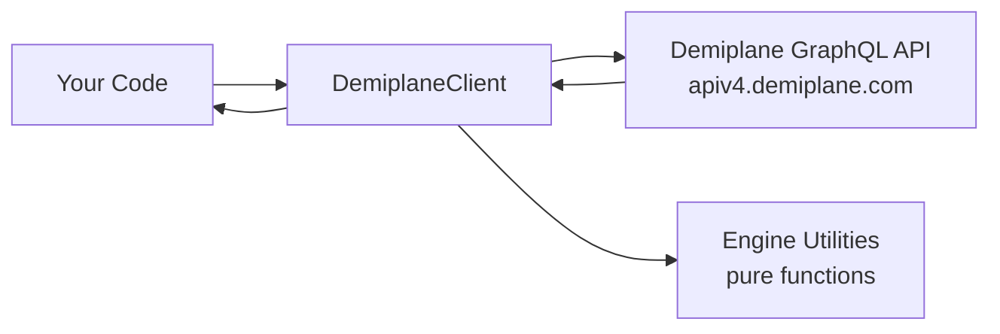

# @scooper4711/demiplane-api

A game-system-agnostic TypeScript client for the [Demiplane Nexus](https://app.demiplane.com) character API. Handles GraphQL queries, engine data parsing, and character updates.

This library is intentionally system-neutral — it knows nothing about specific game systems, compendium packs, or slug conventions. It provides the building blocks for any Demiplane integration.

## Installation

```bash
npm install @scooper4711/demiplane-api
```

Requires Node.js 20 or later.

## Quick Start

```typescript
import { DemiplaneClient, findCustomEngineByName, findEnginesBySlug } from "@scooper4711/demiplane-api";

const client = new DemiplaneClient();

// Public characters can be read without authentication
const data = await client.fetchCharacterData("xxxxxxxx-xxxx-xxxx-xxxx-xxxxxxxxxxxx");
console.log(`Character has ${data.engines.length} engines`);

// Query engines
const hpEngine = findCustomEngineByName(data.engines, "character_hit-points_current");
console.log(`Current HP: ${hpEngine?.value}`);
```

## Authentication

Authentication is optional for read operations on public characters. It's required for write operations (`updateCharacter`).

```typescript
const client = new DemiplaneClient();

// Set a GraphQL bearer token obtained externally (e.g. from a browser session)
client.setToken("your-graphql-jwt");

// The client attaches the token to all subsequent requests automatically
```

The client does not handle credential-based login directly. Obtain a valid GraphQL JWT externally (for example, by extracting it from an authenticated browser session on app.demiplane.com) and pass it via `setToken()`.

If `setToken()` is never called, requests are sent without an Authorization header, which allows reading public characters.

## API Reference

### DemiplaneClient

The primary class for interacting with the Demiplane API.

#### `setToken(token: string): void`

Set a GraphQL bearer token directly. Use this when you already have a valid Hasura JWT (e.g., obtained via browser login or a separate auth script).

```typescript
client.setToken("your-graphql-jwt");
```

#### `isAuthenticated(): boolean`

Returns whether the client currently has a token set.

#### `validateToken(): Promise<void>`

Perform an authenticated read to verify that the current GraphQL bearer token is accepted by Demiplane. Throws when no token is configured or the API rejects the request.

#### `fetchCharacterData(characterId: string): Promise<CharacterData>`

Fetch a character's complete engine data by UUID. Works without authentication for public characters.

```typescript
const data = await client.fetchCharacterData("abc12345-1234-5678-9abc-def012345678");
// data.engines — array of all engine entries
// data.engineCacheIdsBySource — metadata for cache management
```

Throws if:

- The UUID format is invalid (must be 8-4-4-4-12 hex)
- The character is not found
- The response is missing the engines array

#### `fetchCharacterVersion(characterId: string): Promise<CharacterVersion>`

Check a character's current version number. Useful for conflict detection before pushing updates.

```typescript
const version = await client.fetchCharacterVersion("abc12345-1234-5678-9abc-def012345678");
console.log(`Version: ${version.version}, UUID: ${version.uuid}`);
```

#### `fetchAttributeMapping(nexusId: number): Promise<AttributeMapping>`

Retrieve the attribute mapping for a game system by its nexus ID. Describes which store names are user-settable.

```typescript
const mapping = await client.fetchAttributeMapping(28); // 28 = Pathfinder 2e
// mapping.attributeMapping["character_hit-points_current"].set === true
```

#### `updateCharacter(options: UpdateCharacterOptions): Promise<boolean>`

Push updated character data back to Demiplane. Requires a token to be set via `setToken()`.

Returns `true` on success, `false` on failure (network error, non-200 response, or mutation failure). Does not throw on write failures — this makes error handling simpler for callers.

```typescript
const success = await client.updateCharacter({
  id: "abc12345-1234-5678-9abc-def012345678",
  data: updatedCharacterData,
  name: "Valeros",
  level: 5,
  classSlug: "fighter",
});
```

Optional fields (`name`, `level`, `classSlug`, `avatarUrl`, `viewPermission`, `editPermission`) are included in the mutation only when provided.

### Engine Utilities

Pure functions for querying and transforming the engines array. These are the primary way to work with character data.

#### Type Guards

```typescript
import { isCustomEngine, isDemiplaneEngine } from "@scooper4711/demiplane-api";

for (const engine of data.engines) {
  if (isCustomEngine(engine)) {
    // engine is CustomEngine — has .value (string | number | boolean)
  }
  if (isDemiplaneEngine(engine)) {
    // engine is DemiplaneEngine — has .args.slug, .args.id, etc.
  }
}
```

These are mutually exclusive: every engine is exactly one type.

#### `findCustomEngineByName(engines, storeName): CustomEngine | undefined`

Find a custom engine by its store name. Returns `undefined` if no match.

```typescript
const hp = findCustomEngineByName(data.engines, "character_hit-points_current");
const heroPoints = findCustomEngineByName(data.engines, "character_hero-points");
```

#### `findEnginesBySlug(engines, slug): DemiplaneEngine[]`

Find all DemiplaneEngine entries with an exact `args.slug` match.

```typescript
const fighterEngines = findEnginesBySlug(data.engines, "fighter");
```

#### `findEnginesByNamePattern(engines, pattern): CharacterEngine[]`

Find engines whose `name` field matches a regular expression.

```typescript
// Find all spell engines
const spells = findEnginesByNamePattern(data.engines, /^tabula\/spell\//);

// Find all boost engines
const boosts = findEnginesByNamePattern(data.engines, /attribute\/boost/);
```

#### `updateCustomEngineValue(engines, storeName, value): CharacterEngine[]`

Immutably update a custom engine's value. Returns a new array with the matching engine replaced. Non-matching engines are preserved by reference (not cloned). If the store name doesn't exist, returns the original array (same reference).

```typescript
import { updateCustomEngineValue } from "@scooper4711/demiplane-api";

// Set current HP to 42
const updated = updateCustomEngineValue(data.engines, "character_hit-points_current", 42);

// Push the change
await client.updateCharacter({
  id: characterId,
  data: { ...data, engines: updated },
});
```

### Error Handling

#### DemiplaneApiError

Thrown on HTTP failures. Contains structured information for programmatic handling.

```typescript
import { DemiplaneApiError } from "@scooper4711/demiplane-api";

try {
  await client.fetchCharacterData("some-uuid");
} catch (error) {
  if (error instanceof DemiplaneApiError) {
    console.log(error.statusCode); // e.g. 404
    console.log(error.operationName); // "GraphQL request"
    console.log(error.requestUrl); // the URL that failed
  }
}
```

#### Error Behavior Summary

| Operation               | Error Condition          | Behavior                   |
| ----------------------- | ------------------------ | -------------------------- |
| `setToken`              | —                        | Always succeeds            |
| `validateToken`         | No token set             | Throws `Error`             |
| `validateToken`         | Token rejected           | Throws `DemiplaneApiError` |
| `fetchCharacterData`    | Invalid UUID             | Throws `Error`             |
| `fetchCharacterData`    | Not found                | Throws `Error`             |
| `fetchAttributeMapping` | Invalid nexus ID         | Throws `Error`             |
| `updateCharacter`       | No token set             | Throws `Error`             |
| `updateCharacter`       | Network/HTTP failure     | Returns `false`            |
| `updateCharacter`       | Mutation returns failure | Returns `false`            |

## Architecture



### Data Flow

1. **Caller** invokes `DemiplaneClient` methods with character UUIDs or update payloads.
2. **DemiplaneClient** constructs GraphQL queries/mutations, attaches the bearer token (if set via `setToken()`), and sends requests to `https://apiv4.demiplane.com/v1/graphql`.
3. **Demiplane GraphQL API** returns character data as JSON containing the `engines` array.
4. **Engine Utilities** provide pure functions to query, filter, and immutably transform the engines array without any network calls.

### Token Management

The client manages token state internally:

- A single `graphqlToken` field stores the bearer token after calling `setToken()`.
- The token is attached to every GraphQL request when present.
- There is no token refresh or expiry handling — if the token expires, the caller must obtain a new one and call `setToken()` again.
- The client has no persistent storage. Tokens live only in memory for the duration of the client instance.

### Character Data Model

Characters in Demiplane are represented as an array of "engines" — each engine is either a **DemiplaneEngine** (referencing a game rule like a class or feat) or a **CustomEngine** (storing a user-editable value like current HP).

```typescript
// DemiplaneEngine — references game rules
{
  type: "DemiplaneEngine",
  name: "tabula/spell/fireball-rm.eng",
  args: { slug: "fireball-rm", id: "..." }
}

// CustomEngine — stores session state
{
  type: "CustomDemiplaneEngine",
  name: "character_hit-points_current",
  value: 42
}
```

## Extension Points

This library is designed to be consumed by game-system-specific integrations. It handles the Demiplane communication layer while leaving all game-specific logic to the consumer.

### Extending EngineArgs for Your Game System

The `EngineArgs` interface uses an index signature (`[key: string]: unknown`) so that game-specific properties are accessible without casting. When building a system-specific integration, define a local interface that narrows those args to the properties your system uses.

Here's a real example from a PF2e integration that adds spell-related utilities on top of this library:

```typescript
import type { CharacterEngine, DemiplaneEngine } from "@scooper4711/demiplane-api";
import { isDemiplaneEngine } from "@scooper4711/demiplane-api";

/**
 * PF2e-specific engine args for spell entries.
 */
interface Pf2eSpellEngineArgs {
  spellSlot?: string;
  parentSpellFeature?: string;
  isPrepare?: boolean;
  addSpellData?: { baseSpellbookSpell: boolean };
}

function findSpellEngines(engines: CharacterEngine[]): DemiplaneEngine[] {
  return engines.filter((e): e is DemiplaneEngine => isDemiplaneEngine(e) && e.name.startsWith("tabula/spell/"));
}

function findSpellbookSpells(engines: CharacterEngine[]): DemiplaneEngine[] {
  return findSpellEngines(engines).filter((e) => {
    const args = e.args as Pf2eSpellEngineArgs;
    return args.addSpellData?.baseSpellbookSpell === true;
  });
}

function findPreparedSpells(engines: CharacterEngine[]): DemiplaneEngine[] {
  return findSpellEngines(engines).filter((e) => {
    const args = e.args as Pf2eSpellEngineArgs;
    return args.isPrepare === true;
  });
}

function isCurriculumSpell(engine: DemiplaneEngine): boolean {
  const args = engine.args as Pf2eSpellEngineArgs;
  const slot = args.spellSlot;
  return typeof slot === "string" && slot.includes("wizard-school-spellbook-slot");
}
```

This pattern keeps the core library system-agnostic while letting each integration define typed accessors for the args properties its game system uses.

### Building an Integration for Another Game System

To build a sync integration for a different Demiplane-supported game system (D&D 5e, Marvel Multiverse, etc.), you would:

1. **Use `DemiplaneClient`** for all API communication — authentication, fetching character data, pushing updates. This works identically regardless of game system.

2. **Define your own typed args interface** that narrows `EngineArgs` to the properties your system uses (as shown above).

3. **Build your own slug mapper** that translates Demiplane engine slugs into your target system's item identifiers. Each game system has its own slug conventions.

4. **Build your own actor/character translator** that reads the engines array and populates your target system's data model. The engine utilities (`findEnginesBySlug`, `findEnginesByNamePattern`, `findCustomEngineByName`) help you query the data without worrying about the raw structure.

5. **Use `updateCustomEngineValue`** to modify session state values before pushing them back to Demiplane.

### Example: Hypothetical D&D 5e Integration

```typescript
import {
  DemiplaneClient,
  findEnginesBySlug,
  findCustomEngineByName,
  findEnginesByNamePattern,
  updateCustomEngineValue,
} from "@scooper4711/demiplane-api";

const client = new DemiplaneClient();
const data = await client.fetchCharacterData(characterUuid);

// Your game-specific slug mapping
const classEngines = findEnginesBySlug(data.engines, "wizard");

// Your game-specific session state store names
const currentHp = findCustomEngineByName(data.engines, "character_hit-points_current");

// Your game-specific translation logic
// translateToFoundry5e(data.engines, actor);
// translateToRoll20(data.engines, sheet);
// translateToOwlbear(data.engines, character);
```

### What This Library Provides vs. What You Build

| This library provides               | You build                                 |
| ----------------------------------- | ----------------------------------------- |
| Token management                    | Token acquisition for your platform       |
| GraphQL communication               | —                                         |
| Engine array querying and filtering | Slug mapping for your game system         |
| Immutable engine value updates      | Actor/character population logic          |
| Character version checking          | Conflict resolution UI                    |
| Attribute mapping retrieval         | Platform-specific session state detection |
| —                                   | System-specific engine arg types          |

## Types

All types are exported for use in your integration:

```typescript
import type {
  CharacterEngine,
  CustomEngine,
  DemiplaneEngine,
  CharacterData,
  CharacterVersion,
  AttributeMapping,
} from "@scooper4711/demiplane-api";
```

## Common Session State Store Names

Store names vary by game system. Use `fetchAttributeMapping` to discover them programmatically for any nexus. Here are some examples from Pathfinder 2e (nexus ID 28):

| Store Name                     | Type   | Description          |
| ------------------------------ | ------ | -------------------- |
| `character_hit-points_current` | number | Current HP           |
| `character_hit-points_temp`    | number | Temporary HP         |
| `character_hero-points`        | number | Hero points          |
| `character_focus_current`      | number | Current focus points |
| `character_currency_gold`      | number | Gold pieces          |
| `character_currency_silver`    | number | Silver pieces        |
| `character_currency_copper`    | number | Copper pieces        |
| `character_currency_platinum`  | number | Platinum pieces      |

## License

MIT
